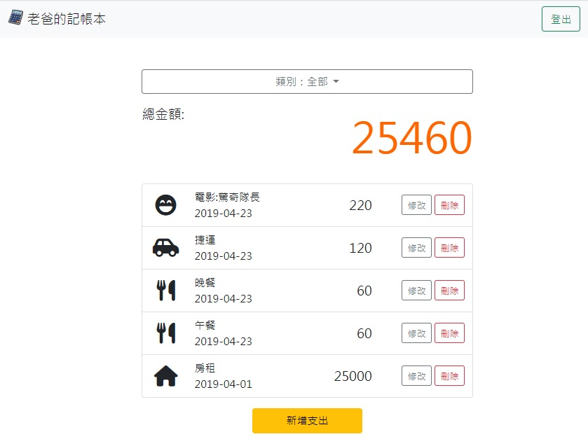

# Expense Tracker

<br>
:sparkles: Record your expense.  

## Features
* Account Management System
* Shows all records or only one category on the homepage.
* You also can add, edit, delete the record info.

## Installation
* Install the Node.js and npm according to your OS(MacOS or Windows).
* Download the project to your local machine.
* Get into your project folder by Terminal and enter
  ```bash
  npm install
  ```

## How to use
* Create a .env file for yourself, refer to the .env.example for details.
* If you need the seeder data enter
  ```bash
  npm run seed
  ```
  It's done when you see
  ```bash
  Category create was done！
  ```
  ```bash
  Record create was done！
  ```
* Get start by enter
  ```bash
  npm run dev
  ```
  It's running when you see
  ```bash
  App is running on http://localhost:3000
  mongodb connected!
  ```
* Open the browser, and enter the URL `http://localhost:3000`
* Register for your own account or use an example account to login.
  Example Account and Password:
  ```bash
  Email: feather@example.com
  Password: 12345678
  ```
* You can stop on Terminal by
  ```bash
  Ctrl + C
  ```

## Build with
* Node.js @14.16.0
* Express.js @4.17.1
* express-handlebars @4.0.2
* mongoose @5.9.7
* Bootstrap @5.1.3
* Font-awesome @6.1.1
* body-parser @1.20.0
* bcryptjs @2.4.3
* connect-flash @0.1.1
* dotenv @8.2.0
* express-session @1.17.1
* Method-override @3.0.0 
* passport @0.4.1
* passport-facebook @3.0.0
* passport-local @1.0.0
